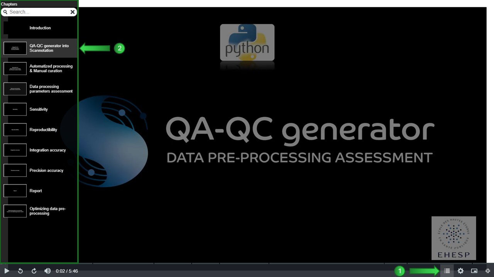

The QA/QC generator evaluates the completeness and robustness of MS1 HRMS data preprocessing.
This tool produces harmonized PARC QA/QC preprocessing outputs and automatically generates a report based on the HBM4EU analytical QA/QC framework and additional project-specific criteria (for further details, please refer to: https://www.sciencedirect.com/science/article/abs/pii/S0165993624001560?via%3Dihub).
\
\
The tool will be available soon.
\
For more information, you can view the video tutorial [on YouTube](https://youtu.be/i5L9XoOHnlY)
or by downloading the file ["QA-QC_generator-tutorial.zip"](https://github.com/scannotation/QA-QC_generator_software/blob/main/QA-QC_generator-tutorial.zip).

## Development
QA-QC generator was developed in Python 3.9 on Windows 11.

## Tutorial
To get started with QA-QC generator, you can view the video tutorial:
* either [on YouTube](https://youtu.be/i5L9XoOHnlY) directly
* or if you want to browse the video using the table of contents (recommended):\
\

\
\
&#x27AA; Please download the file ["QA-QC_generator-tutorial.zip"](https://github.com/scannotation/QA-QC_generator_software/blob/main/QA-QC_generator-tutorial.zip)
and launch in your web browser the file "QA-QC generator_player.html" present in the zip file.

## Help and Technical support
If you have any questions, please contact the developers at this address: scannotation@ehesp.fr.
